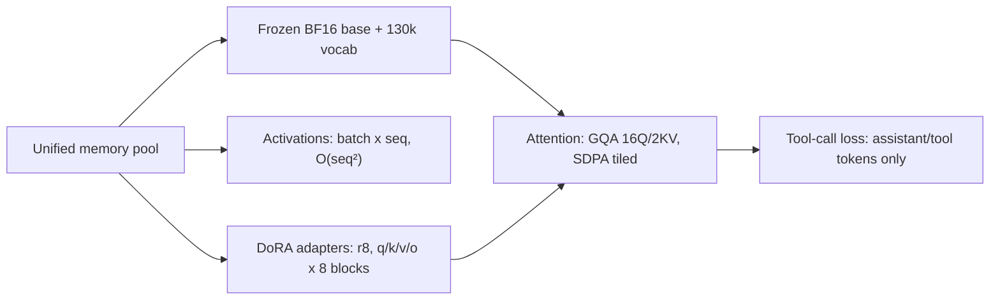
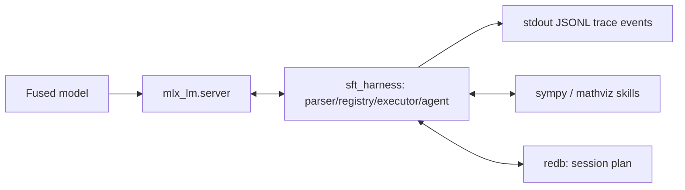

# SFT Using MLX for Agentic Tool Calling

Supervised fine-tuning of [openbmb/MiniCPM5-1B](https://huggingface.co/openbmb/MiniCPM5-1B)
(post-RL/OPD final, BF16) for tool-calling, sized from the hardware up for Apple's MLX-LM on Apple Silicon.

## Training on Apple Silicon Unified memory

Apple Silicon uses a **single memory pool shared by CPU and GPU**, managed through MLX-LM with
zero-copy tensors but the total is fixed (16/24/36GB class machines)
and shared with the OS and apps. Training is sized to live inside that ceiling.

Because weights, activations, gradients, and optimizer state all compete for the same pool,
peak usage — not parameter count alone — determines the feasible configuration:

| Resident | What it is | Scaling |
| --- | --- | --- |
| Frozen base | ~2.2GB BF16 weights + 130k-vocab embedding/LM-head tensors | Fixed, always resident |
| Activations | Per-layer tensors for `batch_size × max_seq_length`; attention is `O(seq²)` | Grows with batch and seq length |
| Trainable | DoRA adapters + AdamW states for `num_layers` × `keys` | Grows with adapted layers and rank |

### DoRA training

DoRA keeps the pretrained weight `W0` frozen and learns a magnitude vector `m` plus a low-rank
direction update (`ΔV ∝ B·A`, rank `r=8`, scale 16). Only the small `A`, `B`, and `m` tensors
receive gradients and optimizer state, which is why it fits the shared pool where full
fine-tuning would not. 

In this project, DoRA adapts only the attention projections (`q/k/v/o`) in the last 8 blocks,
while the MLP, embedding, and LM-head weights stay frozen. `mask_prompt: true` concentrates the
loss on assistant/tool tokens, and `grad_checkpoint: true` with `grad_accumulation_steps: 2`
trades recomputation for a lower peak memory.

### How attention layers are addressed

* How the model's attention is shaped, and which of its
weights DoRA actually updates. MiniCPM5-1B uses grouped-query attention (GQA): 16 query heads read
from just 2 shared key/value heads (`head_dim` 128). Queries are many, while keys and values are few
and reused, so the KV-cache is ~8× smaller than multi-head attention and `seq 2048` activations stay
small in the shared pool. MLX executes it through native `fast.scaled_dot_product_attention` — tiled
and IO-aware (the FlashAttention-2 idea) — computing `softmax(QKᵀ/√d)V` block by block rather than
materializing the full matrix, with no flag to set.

* DoRA then adapts only the attention projections `q_proj/k_proj/v_proj/o_proj` in the last 8 blocks,
keeping the MLP, embeddings, and LM-head frozen. These projections are the tool-routing path: `q/k`
score which `<tools>` span grounds into a `<tool_call>` name plus args, and `v/o` carry that choice
forward — so adapting attention alone learns tool-calling at roughly half the trainable parameters
of all-linear tuning.



| Aspect | In this project | Why it matters |
| --- | --- | --- |
| Attention pattern | GQA: 16 query heads / 2 KV heads, `head_dim` 128 | Small KV-cache keeps `seq 2048` in the shared pool |
| Execution | MLX `fast.scaled_dot_product_attention`, tiled/IO-aware | Blockwise, so no full `seq×seq` matrix is built |
| Adapted weights | DoRA on `q_proj/k_proj/v_proj/o_proj`, last 8 blocks | Fewest parameters that still move the tool-routing signal |

Implemented levers: attention-only `keys` in the last 8 blocks (MLP/embeddings/LM-head frozen);
GQA's 2 KV heads; `mask_prompt: true` concentrating gradients on assistant/tool tokens; and cosine
decay with 10% warmup (`lr 1e-5`) to protect pretrained attention from early large steps. Custom
Metal kernels are forward-only (no gradients) and stay out of training; third-party `mlx-mfa` is
deferred to post-export inference benchmarking. If `<tool_call>` argument accuracy plateaus, raise
`num_layers 8 → 12/16` first, then `r 8 → 16` — never LR first — and compare val loss A/B
(attention-only vs all-linear) in MLflow via `src/visualization.py`.

## MiniCPM5-1B Model

| Param | Value | Hardware consequence |
| --- | --- | --- |
| `hidden_size` / `intermediate_size` / layers | 1536 / 4608 / 24 | 1.08B total, 680M non-embed; DoRA on 8 late layers is enough to start |
| Arch snapshot | `configs/model/minicpm5-1b.config.json` (point-in-time download from HF `main`; re-download to refresh) | YAML holds pointers only (`name`, `hf_repo`, `revision`); per-run `config_sha` logged to MLflow |
| Attention | 16Q / 2KV (GQA group 8), `head_dim` 128 | 2 KV heads keep KV-cache and activation memory tiny at `seq 2048` |
| `vocab_size` | 130560, `tie_word_embeddings: false` | LM head dominates resident memory; frozen during DoRA but still resident |
| Context | 131072 native, `rope_theta` 5000000, `rms_norm_eps` 1e-6 | SFT runs at `max_seq_length: 2048`; long histories extrapolate at export |
| Tokens | `bos` 0, `pad` 1, `eos` [1, 130073] (`</s>`, `<|im_end|>`) | Training must stop on both |
| Chat template | Borrowed from `openbmb/MiniCPM5-1B` | `<\|im_start\|>`, `<tools>`, `<tool_call>`, `<tool_response>`, `enable_thinking` |

Convert before training (chat template ships with the conversion):

```bash
bash scripts/convert_minicpm5_1b.sh  # HF BF16 -> models/minicpm5-1b-bf16
```

Sampling defaults from the 1B model card: No-Think `temperature 0.7`, Think `0.9`, both `top_p 0.95`.

## Project Pipeline


## Agentic Harness (sft_harness)

The harness is a lightweight, Rust-based ReAct agent. It shows the model the available tools and the user's
question, asks a locally served version of the fine-tuned model what to do next, runs any tool the
model requests, and adds the result back to the conversation. It repeats until the model answers on
its own, repeats the same call, or reaches `max_steps: 4`. 

It exists to test the fine-tuned model on realistic multi-turn tool use that `src/eval.py`'s single-shot checks miss. Rust owns the loop,
session state (a small embedded redb database), and tracing; the model and tools run in Python.



| Tool | Behavior |
| --- | --- |
| `solve_symbolic` | Runs the SymPy skill for exact math (arithmetic, equations, calculus, number theory, units); returns the result and LaTeX, or a retry hint |
| `plot_chart` | Runs the matplotlib skill; returns a PNG path under `traces/`, or a retry hint |
| `todo_write` | Keeps the session plan in embedded redb: `create` replaces, `update` appends, `complete` closes it all; echoes the current plan |


MiniCPM5-1B is strongest at logical and mathematical reasoning, so the harness is framed as an educative math agent. 

`solve_symbolic` supplies exact computation the model can trust, `plot_chart` turns abstract results into visuals for teaching, 
and `todo_write` nudges it to plan multi-step work instead of guessing. Together they test whether fine-tuning taught the model
to *reason* with tools on math, not just pattern-match answers.

Tool errors come back as `tool`-role text so the model can self-correct within `max_steps`.

Session state (the plan) lives in an embedded redb database, a Rust-based database so the harness stays a single binary.

Uses:

* Smoke-test one prompt: `--prompt` (plus `--model-url`, `--model`, `--config`); prints
  `{"answer": …, "steps": …}`.
* Trace inspection: append-only JSONL events (`system` / `user` / `assistant` / `tool`, each with
  milliseconds) on stdout.
* Offline verification: Rust unit tests (`cargo test -p sft-harness`) and Python parser-parity +
  CLI integration tests (`uv run pytest tests/`).

```bash
bash scripts/serve_fused.sh models/sft-minicpm5-1b-adapters/export/fused
./target/debug/sft-harness-cli --prompt "Solve x**2 - 5*x + 6 = 0."
cargo test -p sft-harness
```

> Model-id contract: `serve_fused.sh <fused-dir> [--port 8080]` (`--model`),
> `configs/sft_harness/default.yaml:model`, and the chat-completions body `model` (or `--model` /
> `SFT_HARNESS_MODEL`) must all agree — the server resolves the body value as a repo id, so a
> placeholder 404s.

## Quickstart

```bash
uv sync --extra dev
bash scripts/setup_mlflow.sh
bash scripts/convert_minicpm5_1b.sh   # HF BF16 -> models/minicpm5-1b-bf16

# Train (Hydra config; also drives mlx_lm.lora + MLflow).
uv run python -m src.train
# ...or use the bare mlx-lm CLI wrapper (same training, plus pass-through flags):
#   bash scripts/train_lora.sh

bash scripts/export_model.sh models/sft-minicpm5-1b-adapters/adapters
uv run python -m src.eval --model models/sft-minicpm5-1b-adapters/export/fused --data models/sft-minicpm5-1b-adapters/data/test.jsonl
uv run pytest tests/ -v

# Serve the fused model and smoke-test the agentic harness end-to-end.
bash scripts/serve_fused.sh models/sft-minicpm5-1b-adapters/export/fused &
./target/debug/sft-harness-cli --prompt "Solve x**2 - 5*x + 6 = 0."
```

> Note: `models/sft-minicpm5-1b-adapters/` is reused across runs — back up `adapters/` before a new method trial.

## Layout

```
├── configs/                  # Hydra tree (sft_mlx_config.yaml)
│   ├── model/                # minicpm5-1b.yaml (MLX path, arch snapshot)
│   ├── dataset/              # toolace.yaml (ToolACE, max_samples, split)
│   ├── tokenizer/            # default.yaml (max_seq 2048, mask_prompt)
│   ├── lora/                 # default.yaml (dora r8, 8 layers, attention-only keys)
│   ├── training/             # default.yaml (epochs→iters, batch 2, test_batches, grad checkpoint/accum)
│   ├── sft_harness/          # default.yaml (max_steps 4, per-turn tokens 1024, temp 0.9/top_p 0.95, model_url, timeouts 60/15, allowlist: solve_symbolic/plot_chart/todo_write)
│   └── mlflow/               # default.yaml (tracking URI, experiment, registry model)
├── sft_harness/              # Rust ReAct loop (parser/registry/executor/agent/store/trace) over mlx_lm.server HTTP
│   └── skills/               # sympy + mathviz SKILL scripts (JSON in → JSON out)
├── scripts/
│   ├── serve_fused.sh        # mlx_lm.server <fused> (OpenAI-compatible HTTP for sft_harness)
│   ├── convert_minicpm5_1b.sh # mlx_lm convert HF BF16 → models/minicpm5-1b-bf16
│   ├── train_lora.sh         # bare mlx_lm.lora (preps data + trains)
│   ├── export_model.sh       # mlx_lm fuse (adapters → standalone model)
│   └── setup_mlflow.sh       # tracking server
├── src/
│   ├── train.py              # emits lora.yaml (get_lora_keys), runs mlx_lm.lora (+ --test ppl)
│   ├── eval.py               # mlx_lm.generate tool-call spot-checks on test.jsonl
│   ├── data/                 # loader.py + normalize.py → ChatDataset JSONL (<tools>)
│   ├── tracking.py           # MLflow registry
│   └── visualization.py      # loss/LR plots from MLflow histories
├── traces/                   # harness chart PNGs (gitignored; redb sessions use the OS temp dir)
├── tests/                    # parity with mlx-lm/tests (lora config, chat dataset, tool-call)
└── models/                   # minicpm5-1b-bf16 (converted), sft-minicpm5-1b-adapters/
```

## Config cheat sheet

| Group | Key knobs |
| --- | --- |
| `model` | `minicpm5-1b` (`openbmb/MiniCPM5-1B` BF16 → `models/minicpm5-1b-bf16`) |
| `lora` | `default` (dora r=8, scale=16, num_layers=8, attention-only keys) |
| `training` | `num_train_epochs` → iters, `batch_size: 2`, `test_batches: -1`, `grad_checkpoint`, grad accum 2 |
| `tokenizer` | `max_seq_length: 2048`, `mask_prompt: true` |
| `dataset` | `Team-ACE/ToolACE`, `max_samples: 2000`, `test_split_ratio: 0.2`, `format: messages` (held-out `test.jsonl` tail) |
| `mlflow` | `tracking_uri`, `experiment_name`, registry `model_name` (env `MLFLOW_TRACKING_URI`/`MLFLOW_EXPERIMENT` wins) |
| `sft_harness` | `max_steps: 4`, `max_tokens_per_turn: 1024`, `temperature: 0.9`, `top_p: 0.95`, `model_url`, `request_timeout_s: 60`, `tool_timeout_s: 15`, `allowlist` (solve_symbolic, plot_chart, todo_write) |

## Data format spec

ToolACE rows (`conversations: [{from, value}]`, `system: <tool defs>`) normalize to mlx-lm chat rows:

```json
{"messages": [
  {"role": "system", "content": "<tools>solve_symbolic(op, expression)</tools>"},
  {"role": "user", "content": "What is 23 × 47?"},
  {"role": "assistant", "content": "[solve_symbolic(op=\"eval\", expression=\"23*47\")]"}
]}
```

One JSON object per line in `train.jsonl` / `valid.jsonl` / `test.jsonl`. Unknown keys ignored by the loader.

## License

MIT — see [LICENSE](LICENSE). Third-party components (MiniCPM5-1B and ToolACE under
Apache-2.0, mlx-lm under MIT, SymPy and matplotlib under BSD-style) are listed in
[THIRD_PARTY_NOTICES.md](THIRD_PARTY_NOTICES.md).
